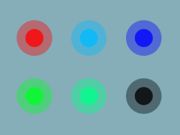

# BT Lights Widget Android

A home screen widget for setting colors of generic Bluetooth lights on Android. 
Is transparent except the preset colors.



Bluetooth Low Energy lights that accept characteristic `0x0009` 
(UUID `0000ffd9-0000-1000-8000-00805f9b34fb`) value `56[red][green][blue]00f0aa` are supported.
Minimal implementation - see Configure below.


## Build & install

Requirements:

* Java
* Android SDK

### Get the source code

```bash
git clone https://github.com/alex-vt/BT-Lights-Widget-Android
cd BT-Lights-Widget-Android
```

### Configure

In `app/res/values/bluetooth_mac_addresses.xml`, replace line 4 with 
one or more Bluetooth MAC addresses of supported lights, 1 per line. 
Example of a line with a MAC address `01:23:45:AB:CD:EF`: `&lt;item&gt;01:23:45:AB:CD:EF&lt;/item&gt;`

_Optionally_, also change the 6 color presets in `app/res/values/colors.xml` 
(keep the attribute names). A preset contains hexadecimal values of red, green and blue 
corresponding color component brightnesses, from `00` to `ff`. 
With all color component values `00`, light can be considered off.

Supported lights can be tested with the `gatttool` Linux command line command.
For a light with the example MAC address `"01:23:45:AB:CD:EF"` the commands for colors will be:

| Color     | Hexadecimal | `gatttool` example command                                                   |
|-----------|-------------|------------------------------------------------------------------------------|
| Light off | `000000`    | `gatttool -b 01:23:45:AB:CD:EF --char-write-req -a 0x0009 -n 5600000000f0aa` |
| Red       | `ff0000`    | `gatttool -b 01:23:45:AB:CD:EF --char-write-req -a 0x0009 -n 56ff000000f0aa` |
| Green     | `00ff00`    | `gatttool -b 01:23:45:AB:CD:EF --char-write-req -a 0x0009 -n 5600ff0000f0aa` |
| Blue      | `0000ff`    | `gatttool -b 01:23:45:AB:CD:EF --char-write-req -a 0x0009 -n 560000ff00f0aa` |
| White     | `ffffff`    | `gatttool -b 01:23:45:AB:CD:EF --char-write-req -a 0x0009 -n 56ffffff00f0aa` |

Also, optionally, padding on all sides of the widget can be adjusted 
in `app/res/layout/widget_layout.xml` lines 10..13 for fine alignment of the widget on home screen.

#### App signing setup

* Put your `keystore.jks` to the project's root folder for signing the app.
* Create a `signing.properties` in the project's root folder with `keystore.jks` credentials:

```
signingStoreLocation=../keystore.jks
signingStorePassword=<keystore.jks password>
signingKeyAlias=<keystore.jks alias>
signingKeyPassword=<keystore.jks key password>
```

### Install on ADB connected device:

```
./gradlew app:installRelease
```

### Build installable APK

```
./gradlew app:assembleRelease
```

Then install `app/build/outputs/apk/release/app-release.apk` on Android device.

Once installed, 2x1 sized BT Lights Widget is available in the list of widgets 
to put on home screen.


## License

[MIT](LICENSE) license.
